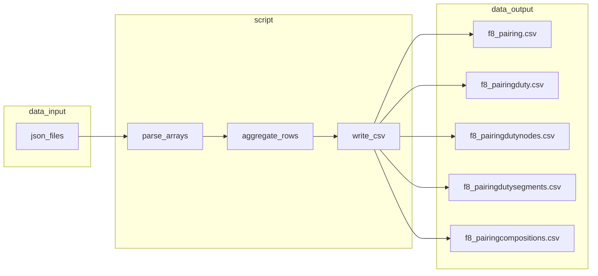

# Pairing JSON 导出为 CSV 脚本

## 输入数据结构（已对照样例）

- 根节点为 **JSON 数组**，每个元素即一个 Pairing 对象（非 `{ "pairings": [...] }` 包装）。
- 典型顶层字段（来自 `data/input/pinguin_yul_pairings_20260409.json`）：`pairingId`, `pairing_dt`, `label`, `airline`, `base`, `sch_str_dt_utc`, `sch_end_dt_utc`, `fleet`, `credit_mn`，以及嵌套数组 `pairingDuty`, **`pairingDutyNodes`**（注意 JSON 中为复数，与口头「pairingDutyNode」对应同一数据）, `pairingDutySegments`, `pairingCompositions`。
- `pairingDuty` / `pairingDutyNodes` 子对象内 **已有** `pairing_id`（与父级 `pairingId` 语义一致），按你的要求只需 **合并行**，不必强制再加一列；若你希望与 segments 一致统一列名为 `pairingId`，可在实现时把子行里的 `pairing_id` 重命名或额外加一列（二选一，默认保留原字段以贴近源数据）。
- `pairingDutySegments` 与 `pairingCompositions` 子对象 **不含** 父 Pairing 的 id，导出前需在每条子记录上 **新增 `pairingId` 列**（值取自父对象的 `pairingId`），再纵向合并。

## 输出文件（均写入 `data/output/`）

| 输出文件 | 来源 | 说明 |
|-----------|------|------|
| `f8_pairing.csv` | 每个根对象 | 去掉 4 个嵌套数组键，其余顶层键作为列；`null` 写空字符串 |
| `f8_pairingduty.csv` | 所有 `pairingDuty` 元素 | 纵向合并 |
| `f8_pairingdutynodes.csv` | 所有 `pairingDutyNodes` 元素 | 纵向合并（读取键名 `pairingDutyNodes`） |
| `f8_pairingdutysegments.csv` | 所有 `pairingDutySegments` 元素 | 每条先注入父级 `pairingId`（建议作为 **首列** 便于关联），再合并 |
| `f8_pairingcompositions.csv` | 所有 `pairingCompositions` 元素 | 同上注入父级 `pairingId` 后合并 |

## 多文件行为

- 遍历 `data/input` 下 **全部 `.json`**，依次解析；同一轮运行内将所有文件中的 Pairing **汇总到同一套 5 张 CSV**（便于你「以后重复执行」得到全量快照）。
- **说明**：若不同文件中出现相同 `pairingId`，结果中会存在多行；脚本默认不做去重。若后续需要去重或增加 `source_file` 列区分来源，可再迭代。

## 实现要点（stdlib 即可）

- 脚本路径：`scripts/pairing_json_to_csv.py`（与现有 `scripts/split_big_table.py` 等工具并列）。
- 使用 `pathlib`、`json`、`csv`；`utf-8-sig` 写出 CSV 可在 Excel 下减少中文/编码问题（可选，实现时二选一并写进脚本注释）。
- **列集合**：对每张「子表」在内存中收集所有出现过的键的并集作为表头（避免不同 Pairing 子对象字段略有不齐时缺列）。
- **健壮性**：某键缺失或为空列表时跳过；子元素非 dict 时跳过或记录警告（任选其一，默认跳过）。
- **CLI**：支持 `--input-dir`、`--output-dir` 默认分别为 `data/input`、`data/output`；自动 `mkdir` 输出目录。
- **入口**：`if __name__ == "__main__"`，便于 `python scripts/pairing_json_to_csv.py` 重复执行。

## 数据流（概念）

## 验收方式

- 在项目根目录运行：`python scripts/pairing_json_to_csv.py`
- 检查 `data/output/` 下 5 个文件存在且行数合理；抽查 `f8_pairingdutysegments.csv` / `f8_pairingcompositions.csv` 首列为父级 `pairingId` 且与对应 `f8_pairing.csv` 一致。
